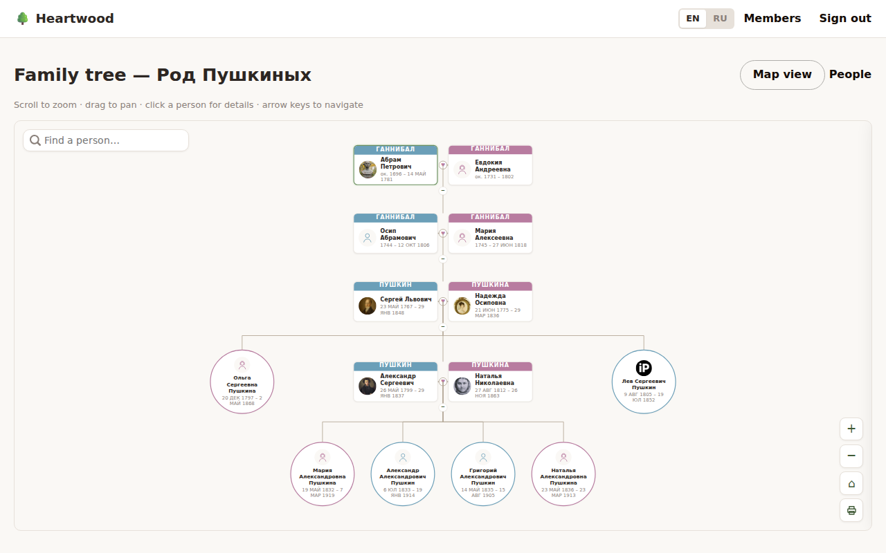
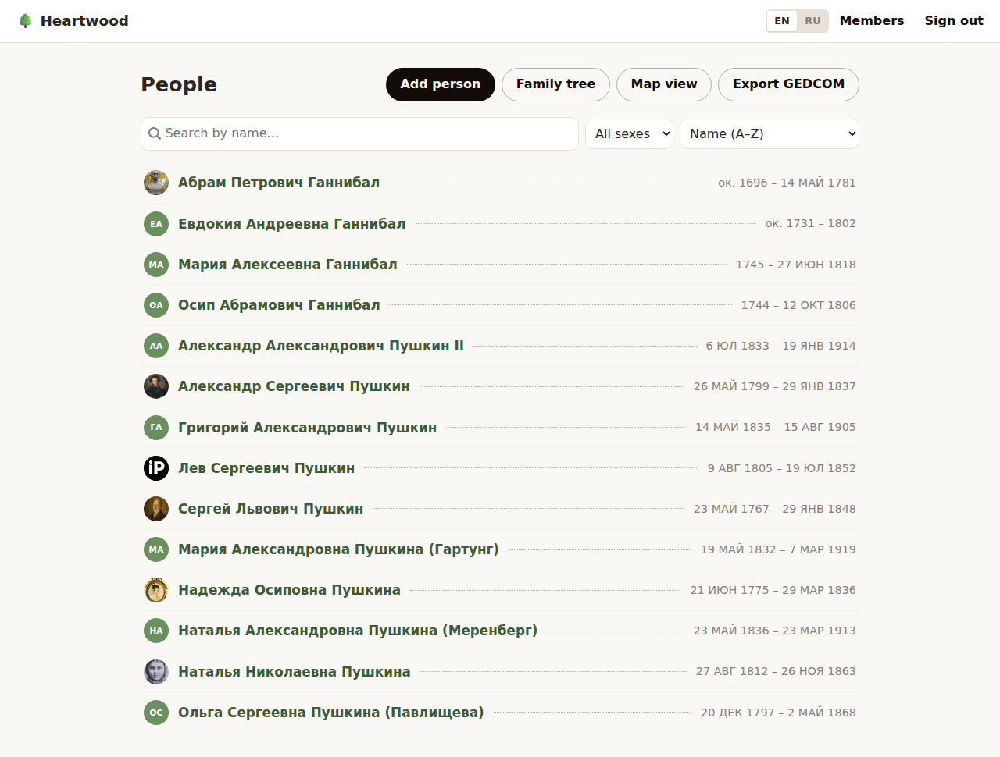
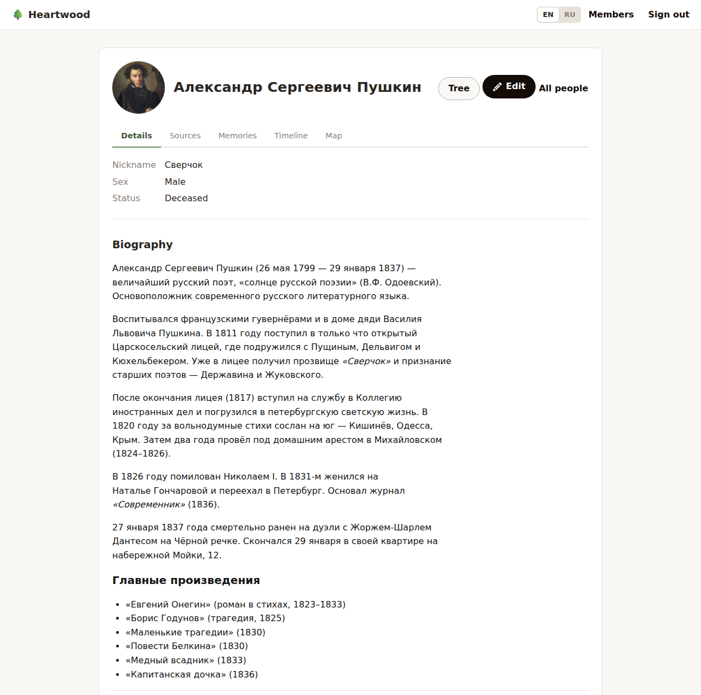
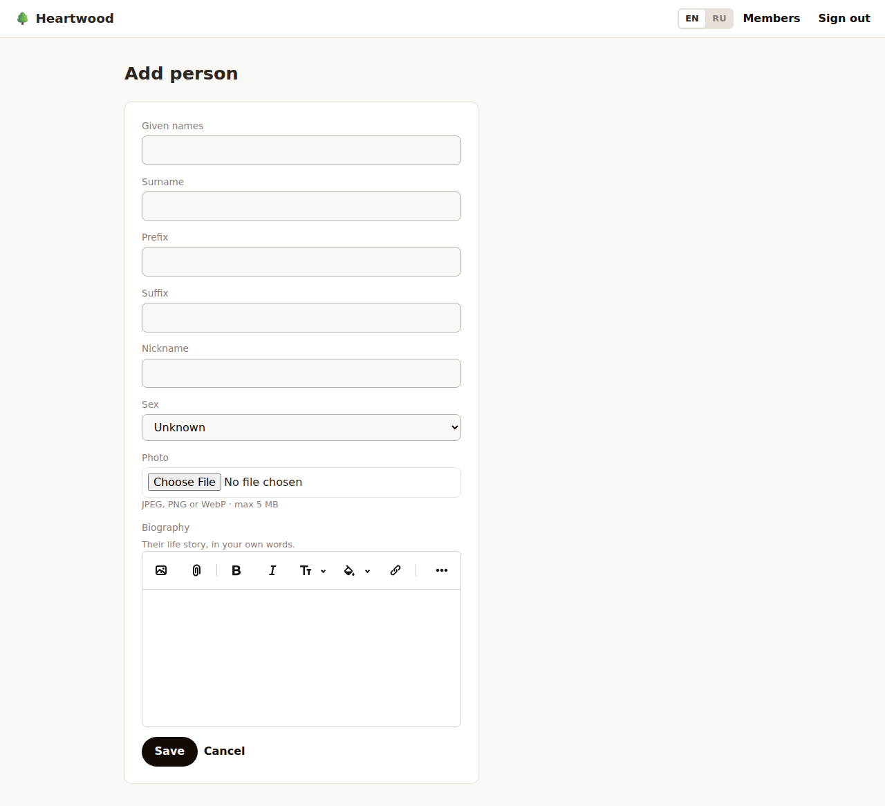

# Heartwood

> The living core of your family tree — open, yours, and built to last generations.

[](https://github.com/andreiyurik/heartwood/actions/workflows/ci.yml)
[](LICENSE)
[](Gemfile)
[](Gemfile)
[](docs/interop/gedcom.md)

Heartwood is an **open-source, self-hostable family tree / genealogy platform** — the
evidence-first data depth of desktop tools like Gramps, with a family editing one tree
together from a browser instead of one person's local file. Run it on your own server for
free, forever — or let us host it for you for a small fee if you'd rather just fill in your
family's story and not think about servers.

The name is the dense, enduring core of a tree's trunk. That's the idea: an open **core**
you truly own, that outlives any single company or subscription.

## Contents

- [Screenshots](#screenshots)
- [Works great with Gramps](#works-great-with-gramps)
- [How Heartwood compares](#how-heartwood-compares)
- [Philosophy](#philosophy)
- [Open core, fair hosting](#open-core-fair-hosting)
- [Tech stack](#tech-stack)
- [Self-hosting](#self-hosting)
- [Documentation](#documentation)
- [Contributing](#contributing)
- [License](#license)

## Screenshots

[](docs/screenshots/family-tree.png)

| People list | Person profile | Add person |
|:-----------:|:--------------:|:----------:|
| [](docs/screenshots/people-list.png) | [](docs/screenshots/person-profile.png) | [](docs/screenshots/add-person.png) |

## Works great with Gramps

Heartwood is built to be **the cloud, collaborative counterpart to [Gramps](https://gramps-project.org/)** —
not a competitor to it:

```
Family fills in the tree together in Heartwood (cloud, live, multiple relatives)
        → export GEDCOM 7.0 / GEDZIP
        → open in Gramps (free, local, offline — reports, DNA tools, custom filters)
        → edit further there
        → re-import into Heartwood, merges back into the shared cloud tree
```

We deliberately don't chase feature-parity with Gramps' deep desktop power-tools (reports,
DNA, plugins) — we hand off to real Gramps for that instead of rebuilding it badly. What
Heartwood adds is the thing a single-user desktop app fundamentally can't do: multiple
relatives editing the same tree live, from a browser, with no lock-in either direction.

## How Heartwood compares

The open-source genealogy space has powerful tools, but they were built in the PHP/desktop
era. The polished tools (Ancestry, MyHeritage) are closed and rent-seeking. **Heartwood
owns the unoccupied corner: modern UX + open + self-hostable + managed-optional, all at once.**

| Feature | **Heartwood** | webtrees | Gramps Web | GeneWeb | Ancestry |
|---|:---:|:---:|:---:|:---:|:---:|
| **Setup & Hosting** |
| Open source | ✅ AGPL | ✅ GPL | ✅ GPL | ✅ LGPL | ❌ |
| Self-hostable | ✅ | ✅ | ✅ | ✅ | ❌ |
| Managed hosting option | ✅ | ❌ | ❌ | ❌ | ✅ ($$$) |
| One-command deploy (Kamal) | ✅ | ❌ | ❌ | ❌ | — |
| SQLite in production — zero DB ops | ✅ | ❌ MySQL | ❌ | ❌ | — |
| No Node.js / no build step | ✅ | ✅ | ⚠️ | ✅ | — |
| **Core Genealogy** |
| GEDCOM import | ✅ | ✅ | ✅ | ✅ | ✅ |
| GEDCOM export — no lock-in | ✅ | ✅ | ✅ | ✅ | ⚠️ limited |
| Interactive tree view (pedigree / descendants) | ✅ | ✅ | ✅ | ⚠️ | ✅ |
| Person profiles with life events | ✅ | ✅ | ✅ | ✅ | ✅ |
| Sources & citations (evidence-first, confidence levels) | ✅ | ✅ | ✅ | ⚠️ | ✅ |
| Photo & media attachments | ✅ | ✅ | ✅ | ❌ | ✅ |
| Rich-text life story / biography | ✅ | ⚠️ notes | ⚠️ | ❌ | ✅ |
| Relationship calculator | ✅ | ✅ | ✅ | ✅ | ✅ |
| **Collaboration** |
| Multi-user support | ✅ | ✅ | ✅ | ❌ | ✅ |
| Role-based access (owner / editor) | ✅ | ✅ | ⚠️ | ❌ | ✅ |
| Multiple trees per installation | ✅ | ✅ | ✅ | ⚠️ | ✅ |
| Living-person privacy (built into schema) | ✅ | ✅ | ✅ | ✅ | ⚠️ |
| **UX & Design** |
| Modern, responsive UI | ✅ | ⚠️ | ⚠️ | ❌ | ✅ |
| Inline editing — no page reloads | ✅ Hotwire | ⚠️ | ⚠️ | ❌ | ✅ |
| Timeline view | ✅ | ✅ | ✅ | ❌ | ✅ |
| Place maps | ✅ | ✅ | ✅ | ❌ | ✅ |
| **Advanced** |
| Smart hints / duplicate matching | ⚠️ within-tree | ❌ | ❌ | ❌ | ✅ ($$$) |
| DNA matching | 🔜 | ❌ | ❌ | ❌ | ✅ ($$$) |
| Free forever, no subscription | ✅ | ✅ | ✅ | ✅ | ❌ |

> ✅ Supported · ⚠️ Partial · ❌ Not available · 🔜 Planned · — Not applicable

## Philosophy

- **Own your roots.** Your family's history is too important to rent. The core is
  AGPL-licensed and self-hostable in minutes.
- **Boringly solid.** A canonical Rails 8 app — SQLite, Hotwire, vanilla CSS, no Node,
  no build step, no Redis. Easy to deploy, easy to understand, easy to keep alive.
- **For real people.** Intuitive enough for a grandparent to add a cousin, powerful
  enough for a serious genealogist (GEDCOM import/export, sources, media).
- **Global by construction.** Bilingual (English + Russian) from the first release, on
  generic Rails I18n — because a popular open-source family-tree app has to work for
  people who don't read English.

## Open core, fair hosting

- **Self-host** the full core for free under the AGPL-3.0.
- **Hosted plan** (optional): pay monthly or once, and use our server — same app, zero ops.

## Tech stack

The "vanilla Rails" stack, on purpose:

- **Ruby on Rails 8.1** — the framework
- **SQLite** — the database (yes, in production)
- **Hotwire** (Turbo + Stimulus) — interactivity without a SPA
- **Propshaft + importmap** — assets with no Node, no bundler
- **Vanilla CSS** — modern CSS, no framework
- **Solid Queue / Cache / Cable** — jobs, cache, websockets on the database
- **Kamal** — deploy anywhere with one command

## Self-hosting

```bash
git clone https://github.com/andreiyurik/heartwood.git
cd heartwood
bin/setup
bin/rails server
```

Open http://localhost:3000 and start your tree. Production deploy is one `kamal deploy`
away — see `config/deploy.yml`.

## Documentation

The full design lives in a linked Markdown vault at [`docs/index.md`](docs/index.md) —
domain model, GEDCOM/import-export strategy, architecture decisions (ADRs), and the
product roadmap. It's written to be read by humans and coding agents alike, and it's the
single source of truth: if code and docs disagree, the docs win.

## Contributing

Issues and pull requests are welcome. Before working on something non-trivial, please open
an issue first to discuss the approach — it's a canonical vanilla-Rails app on purpose (see
[`docs/architecture/stack.md`](docs/architecture/stack.md) for the hard constraints), and
we'd rather align early than review a PR that goes against the grain of the project.

## License

The Heartwood core is licensed under the **GNU Affero General Public License v3.0**
(AGPL-3.0). See [LICENSE](LICENSE). In short: it's free to use, modify, and self-host —
and if you run a modified version as a network service, you share your changes back.
